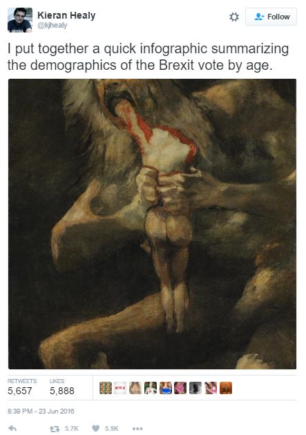
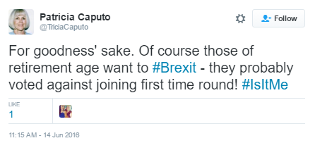
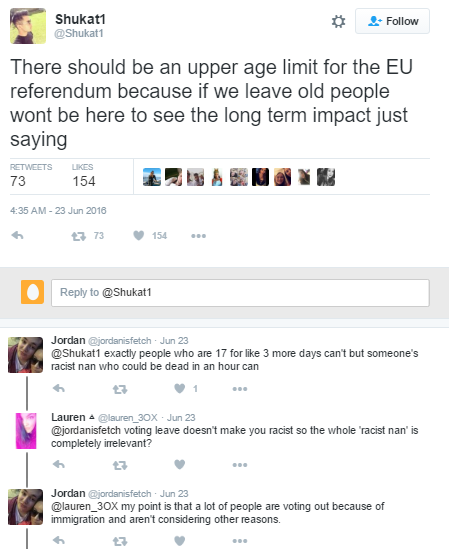
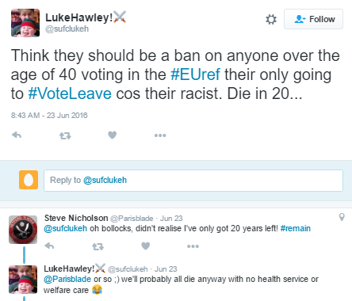
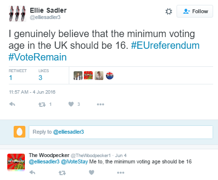
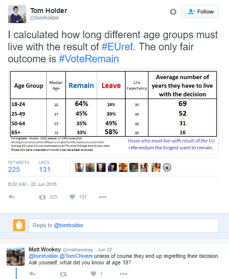
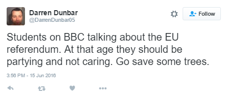
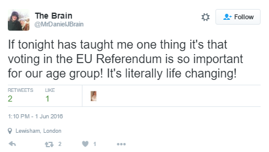

    

        

    

<h3>Overview</h3>

Post-Brexit Britain is in a state of political and social fracture – and there was widespread disbelief when the results were announced. Bookies had stay at 3-10 and leave at 5-2; polls suggested it was close to a foregone conclusion that the stay vote would win. There was jubilation in the Leave camp, coupled with a rising sense of unease at the inevitable question – what now?

This paper examines what the young and the old were saying on social media before and after the Brexit vote, and attempts to answer the question on the lips of Remain supporters – how did it come to this?

One of the more popular theories in this debate is that the younger generation have been let down by an out of touch, disengaged older generation. That younger citizens desperately wanted to stay, but were voted down by their parents and grandparents; that the ambitions of the young and hopeful were eaten by the old and fearful.

According to a YouGov.co.uk poll of 554 registered voters aged of 18 to 24, 75% of the age group intended to vote to remain. Of interest to us was the 10% of these voters that didn’t vote - against only 2% of voters over the age of 65 that chose not to vote.  If these figures could be extrapolated out, would that 10% of voters have been enough to swing the vote to a decision to stay? Need attribution link

<table style="margin-left:auto; 
    margin-right:auto;">
     <caption>YouGov.co.uk Brexit Poll</caption>
  <tr>
    <th></th>
    <th>18-24</th>
    <th>25-49</th>
    <th>50-64</th>
    <th>65+</th>
  </tr>
  <tr>
    <td><strong>Sample Size</strong></td>
    <td>554</td>
    <td>2042</td>
    <td>1174</td>
    <td>1002</td>
  </tr>
  <tr>
    <td><strong>Pre Vote Day</strong></td>
    <td></td>
    <td></td>
    <td></td>
    <td></td>
  </tr>
  <tr>
    <td>Remain</td>
    <td bgcolor="#fcbf31">75</td>
    <td>56</td>
    <td>44</td>
    <td>39</td>
  </tr>
  <tr>
    <td>Leave</td>
    <td>25</td>
    <td>44</td>
    <td>56</td>
    <td bgcolor="#fcbf31">61</td>
  </tr>
  <tr>
    <td><strong>After Voting Closed</strong></td>
    <td></td>
    <td></td>
    <td></td>
    <td></td>
  </tr>
  <tr>
    <td>Remain</td>
    <td>66</td>
    <td>52</td>
    <td>42</td>
    <td>38</td>
  </tr>
  <tr>
    <td>Leave</td>
    <td>23</td>
    <td>40</td>
    <td>53</td>
    <td>59</td>
  </tr>
  <tr>
    <td>Did not Vote</td>
    <td bgcolor="#fcbf31">10</td>
    <td>7</td>
    <td>5</td>
    <td>2</td>
  </tr>
</table>

So we decided to look into social media to investigate further.  Using Crimson Hexagon (link), we analysed 297,474,704 tweets, Facebook and Tumblr posts, blogs and forums originating from the UK in June 2016. This social media research approach affords us an intimate and uniquely honest view of the entire online conversation from public sources.

<h3>The Old vs The Young?</h3>

Much has been made of the youth being angry at ‘old’ people voting against their interest, as tweets such as this show:

   

And weighing up the decision based on life expectancy:

Social media analysis shows, though, that the youth were remarkably ambivalent about Brexit before the referendum.

From the 297 million posts generated during  June of 2016 in the UK, we identified 7 496 582 that discussed Brexit.  The Crimson Hexagon platform then used a complex algorithm to identity the age groups associated with those posts.  The platform was able to identify the age of over 22% of those posts.  This does not look at whether these posts were for or against leaving, but rather looks at the level of engagement of various age groups in the conversation.  This leaves us with 1 707 771 posts to analyse – a very healthy sample of public opinion on Brexit.

  

What we see above is a spectacular lack of engagement in the topic from the very people we would expect to engage – young, social media savvy voters, purportedly with a strong interest in staying in the EU.

Looking at the age band 18-35 collectively – at their height (23-26 June) contributed only 6.3% of the total conversation on Brexit.  And within days of the referendum (27-30 June) this had dropped to a lamentable 3.5% of the conversation.

 
Between the 1 and the 22nd June, Britain’s youngest eligible voters (18-24 year olds) devoted only 0.27% of their online conversation to Brexit. This figure climbed to an unimposing high of 3.8 % of their total conversation on the weekend after the referendum, and then plummeted to only 0.69% for the remainder of June.

By contrast, the 35 plus group devoted 2.61% of their total online conversation to Brexit during the period 1-22 June (9 times as much as the youth), rose to a high of 7.99% on the day of the referendum (twice as much as the youth) and then continued at 9.94% (14 times as much as the youth) for the remainder of June.

Citizens under the legal voting age were considerably more engaged than those aged 18-24 and 25-35, but far less engaged than those aged over 35.

And in amongst all of this were the various sentiments. Before the referendum, resent towards the young:

After the referendum, regret from the young:

And after the referendum, older people defending themselves:

      

    

    

  

   
