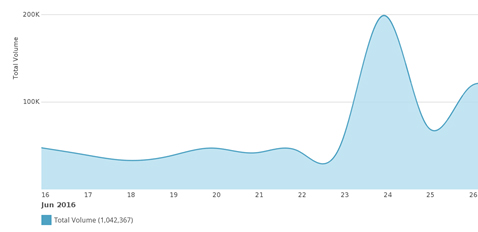
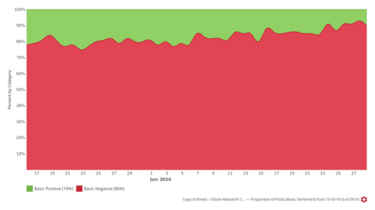

    

        

    

In the wake of the Brexit vote, mainstream media has been reporting on the rise in hate crimes committed across the UK.

According to the National Police Chiefs Council, hate crimes reported to them rose with 57% between Thursday 23rd and Sunday 26th, compared to the corresponding days four weeks prior. The police online hate-crime reporting site, True Vision, tells an ever starker tale, stating the reports to the site have increased by 500% between the 23rd and the 30th of June when compared with a weekly average for 2016.

While traditional sources can provide statistics regarding the rate of reported incidents, this can only give us a partial picture. Many incidents are not reported for a variety of reasons, from the victim not realising that a crime has indeed occurred to a mistrust in the efficacy of the police. These reports also do not tell us anything about the sentiment of the general public on the issue.

Our social media analysis looked at almost 5 and a half million posts, tweets, blogs and forum entries from the UK, dating back to the 1st of January 2016, all relating to xenophobia, racism and prejudice against  either immigrants or minority groups. This in-depth look at what Britons are actually saying and sharing paints a much richer picture of how the UK is reacting to the issue of rising post (and pre!) referendum displays of hate and intolerance.

<h3>RISE IN PUBLIC DISPLAYS OF INTOLERANCE</h3>

Personal accounts of post-referendum racism have flooded social media and, by extension, mainstream media with European citizens in England as well as non-white Britons falling victim to emboldened bigoted 

        

    

    

        

    

    

        

    

     

        

    

     

        

    

     

        

    

     

        

    

    

        

    

    

        

    

Facebook albums and Twitter accounts like Worrying Signs and PostRefRacism have become popular forums to discuss and share stories of hate crimes and intimidation. The @PostRefRacism Twitter handle has been mentioned over than 4,300 times since the referendum, more than any other.  #PostRefRacism has been used more than 34,000 times since the 23rd of June. The only on-topic hashtag that was used more is, unsurprisingly, #Brexit.

        

    

    

        

    

        

    

    

        

    

We looked at all UK conversation on the topic of xenophobia and found that the volume of conversation in the week after the referendum rose with 256%.

Although there was a substantial amount of xenophobic rhetoric leading up to the vote, the week of 23 June to 29 June saw social media engagement rise to a massive 749,975 on-topic contributions in comparison to 292,392 the week leading up to the vote.

 

 

    

 

 

Over the same time period overall negativity in the xenophobic conversation increased to over 90% (a jump of 10% in 10 days).

 

        

    

        

    

<h3>About The Citizen Research Centre</h3>

<a href="{{site.url}}" target="_blank">The Citizen Research Centre</a> is an organisation dedicated to investigating our societies and providing accurate, meaningful data that can be used to effect change – through knowledge, understanding of ourselves and ‘the other’ and through policy.

We describe what we do as social research. This is research done in order to improve and expand on our knowledge of the world by providing decision makers in social policy and intervention projects with the best data possible.

We run primary face-to-face research - both quantitative and qualitative - in 54 countries in Africa and the Middle East. <a href="http://citizenresearchcentre.org/where-we-work.html">Click here</a> for a list of countries in which we run face-to-face research.

We run analytic research on social media globally through our partnership with <a href="http://www.crimsonhexagon.com/" target="_blank">Crimson Hexagon</a>, arguably the best social media analysis platform in the world. This and other reports are generated through mining and reporting on our social media data base, which currently holds almost 1 trillion pieces of social media data.

We are committed to providing research on Citizens, and also research for Citizens – that reflect their own views back to them through social media analytics.

    

    

