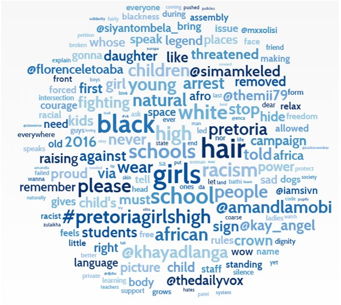
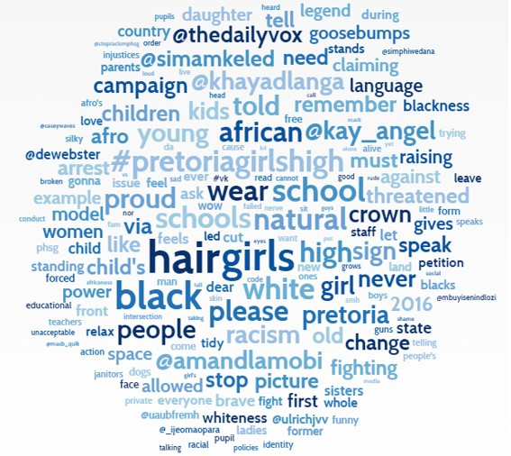
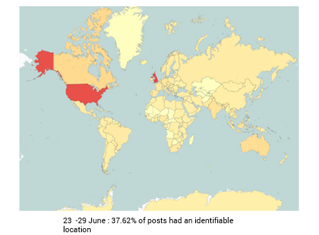
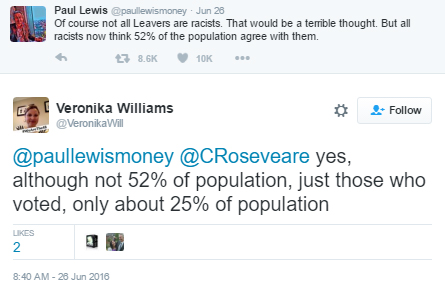
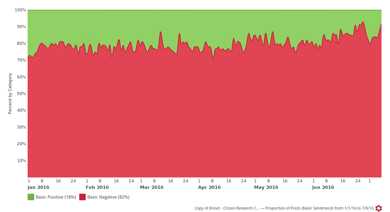
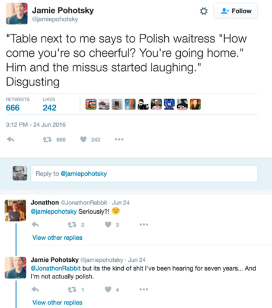
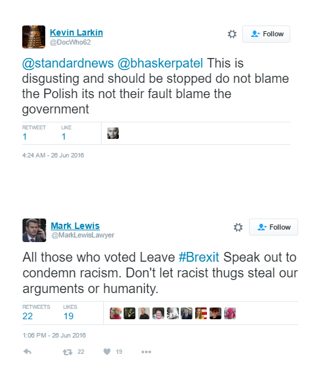
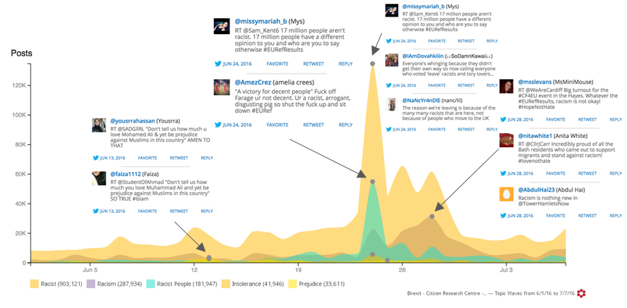

    

        

    

In the wake of the Brexit vote, mainstream media has been reporting on the rise in hate crimes committed across the UK.

According to the National Police Chiefs Council, hate crimes reported to them rose with 57% between Thursday 23rd and Sunday 26th, compared to the corresponding days four weeks prior. The police online hate-crime reporting site, True Vision, tells an ever starker tale, stating the reports to the site have increased by 500% between the 23rd and the 30th of June when compared with a weekly average for 2016.

While traditional sources can provide statistics regarding the rate of reported incidents, this can only give us a partial picture. Many incidents are not reported for a variety of reasons, from the victim not realising that a crime has indeed occurred to a mistrust in the efficacy of the police. These reports also do not tell us anything about the sentiment of the general public on the issue.

Our social media analysis looked at almost 5 and a half million posts, tweets, blogs and forum entries from the UK, dating back to the 1st of January 2016, all relating to xenophobia, racism and prejudice against  either immigrants or minority groups. This in-depth look at what Britons are actually saying and sharing paints a much richer picture of how the UK is reacting to the issue of rising post (and pre!) referendum displays of hate and intolerance.

<h3>RISE IN PUBLIC DISPLAYS OF INTOLERANCE</h3>

Personal accounts of post-referendum racism have flooded social media and, by extension, mainstream media with European citizens in England as well as non-white Britons falling victim to emboldened bigoted 

        

    

    

        

    

    

        

    

     

        

    

     

        

    

     

        

    

     

        

    

    

        

    

    

        

    

Facebook albums and Twitter accounts like Worrying Signs and PostRefRacism have become popular forums to discuss and share stories of hate crimes and intimidation. The @PostRefRacism Twitter handle has been mentioned over than 4,300 times since the referendum, more than any other.  #PostRefRacism has been used more than 34,000 times since the 23rd of June. The only on-topic hashtag that was used more is, unsurprisingly, #Brexit.

        

    

    

        

    

        

    

    

        

    

We looked at all UK conversation on the topic of xenophobia and found that the volume of conversation in the week after the referendum rose with 256%.

Although there was a substantial amount of xenophobic rhetoric leading up to the vote, the week of 23 June to 29 June saw social media engagement rise to a massive 749,975 on-topic contributions in comparison to 292,392 the week leading up to the vote.

 

 

    

        

    

    

     

Over the same time period overall negativity in the xenophobic conversation increased to over 90% (a jump of 10% in 10 days).

    

 

    

        

    

Women and men discussed the same topics on the issue however they do so with varying priority towards specific topics.

After the shared Racist and Racism topics the highest discussion points for men were around Brexit and the Vote.

In the list of main themes, female conversation brought in topics such as Thinking and Love.

Immigration barely features as a top issue for discussion among women compared to their male counterparts.

There was a small but significant increase in the percentage of conversation contributed by women up from 36% in the week pre-vote to 41% in the week following the vote.

    
 

        

    

The conversation about post referendum racism has by no means been contained borders of the UK.

In the week leading up to the referendum, almost 63% of the global conversation referencing both the Brexit vote and xenophobia, racism or other migrant prejudice came from the UK, with close to 23% originating from the US. The next closest contributing country was Ireland with a mere 1.15%.

In the 7 days post vote, 38.08% of the global conversation came from the United States, rivalling the UK at 39.37%. Canada and Australia were the next most involved countries with Ireland’s increased contribution at 1.43% earning them the number 6 spot.

    

    

        

    

<h3>EMBOLDENED MINORITY</h3>

Immigration is a complex issue, currently inflamed by the refugee crisis. Although no correlation has been found between those affected by immigration influx and Leave voters, it is a legitimate topic for conversation.

   

Racism, xenophobia and intolerance on the other hand are irrational and usually based in fear or ignorance. It is inevitable that every society, once it reaches a certain size, will have its share of people who hold these views. Ideally, the values of the rest of the community that these individuals find themselves in temper their actions and reduces how entitled they feel about their bigoted views.

    

    

        

    

Since the affinities and views of these people are most often represented by the right, it stands to reason that the majority of prejudice, anti-immigrant or outright racist voters would have voted Leave.

The effect of the EU referendum result has been to embolden people like this. It has given them the confidence to gloat in public. The perception that 52% of the country agree with them has instilled them with a sense of national pride which they wield as a weapon to attack anyone they see as not 'english'. 

   

The problem comes with extrapolating the 52%. Yes, 52% of voters on the day voted to leave but that would make up only about 23% of the British population and does not factor in the millions of non-citizen residents.

 

The reality is that of that 23%, the vast majority of Leave voters are not extremists, most hold moderate albeit mostly right leaning, views. Although immigration has been turned into a hot topic by the Leave campaign, suggesting that this was a large factor in convincing the public to vote to Leave, the idea that more than half the country condone racist behaviour is a dangerous one.

    

    

        

    

<h3>PUBLIC PUSHBACK</h3>

Analysing the growth in volume of this conversation draws an outline around how important the issue is to social media users however, it does not tell us what the overall sentiment of the conversation is. Quantifying the feelings involved in this conversation is an overwhelmingly difficult task as opinions on such a highly politicised issue are complex and multifaceted.

That said, within the online conversation regarding intolerance, bigotry and racism, we note an initially high negative sentiment (as would be expected given the topic) but also a consistent growth in negativity - eventually exceeding 90% of the conversation. The more recent growth in negativity was directly the result of UK citizens directly opposing and condemning the behaviour of those enacting their prejudices.

    

    

        

    

We have found a track record of pre-emptive counter narrative as well as a large outpouring of support for victims, and calls for unity. Brits from both camps are standing up to, or at least speaking out against, bigoted, racist and prejudice behaviour from their fellow countrymen.

   

    

    

        

    

There is an underwhelmingly amount of the on-topic conversation which in itself is racist or xenophobic, much of it is actively speaking out against this kind of behaviour.  On-line petition sites like Change.org are hosting various petitions like the “Prosecute Nigel Farage under the Racial and Religious Hatred Act 2006” petition which to date has almost 40,000 signatures.

Groups like iStreetWatch.co.uk are urging people to act when they witness hate crimes and harrasment and to report them to police. To date almost 3000 people have taken their pledge to help end street harassment.

    

    

        

    

<h3>About The Citizen Research Centre</h3>

<a href="{{site.url}}" target="_blank">The Citizen Research Centre</a> is an organisation dedicated to investigating our societies and providing accurate, meaningful data that can be used to effect change – through knowledge, understanding of ourselves and ‘the other’ and through policy.

We describe what we do as social research. This is research done in order to improve and expand on our knowledge of the world by providing decision makers in social policy and intervention projects with the best data possible.

We run primary face-to-face research - both quantitative and qualitative - in 54 countries in Africa and the Middle East. <a href="http://citizenresearchcentre.org/where-we-work.html">Click here</a> for a list of countries in which we run face-to-face research.

We run analytic research on social media globally through our partnership with <a href="http://www.crimsonhexagon.com/" target="_blank">Crimson Hexagon</a>, arguably the best social media analysis platform in the world. This and other reports are generated through mining and reporting on our social media data base, which currently holds almost 1 trillion pieces of social media data.

We are committed to providing research on Citizens, and also research for Citizens – that reflect their own views back to them through social media analytics.

    

    

