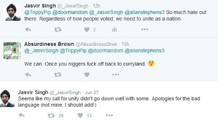

    

        

    

    <h3>Overview</h3>

In the wake of the Brexit vote, mainstream media has been reporting on the rise in hate crimes committed across the UK.

According to the National Police Chiefs Council, hate crimes reported to them rose by 57% between Thursday 23rd and Sunday 26th of June 2016, compared to the corresponding days four weeks prior.

The police online hate-crime reporting site, True Vision, tells an ever starker tale, stating that reports to the site have increased by 500% between the 23rd and the 30th of June when compared with a weekly average for 2016.

While using these types of traditional sources can provide statistics regarding the rate of reported incidents, this can only give us a partial picture. Many incidents are not reported for a variety of reasons, and these reports also do not tell us anything about the opinion of the general public on the issue.

Using <a href="http://crimsonhexagon.com" target="_blank">Crimson Hexagon</a>, a premier social media analytics platform, we looked at almost 5 and a half million posts, tweets, blogs and forum entries from the UK. This was the volume of posts that, between the 1st January and the 9th July 2016 related to xenophobia, racism and prejudice against either immigrants or minority groups.

This in-depth look at what Britons are actually saying and sharing, paints a rich picture of how the UK is reacting to the issue of rising post (and pre!) referendum displays of hate and intolerance.

<h3>Hot Topics</h3>

The timeline below shows the dramatic rise in online conversation on the topic of xenophobia after the Brexit vote. It is important to point out that this is all conversation on the topic including direct hate speech, discussion of the issue or advocacy against it.

In the week of 16-22 June there was already a significant number of posts - 292,392 - relating to xenophobia and prejudice against immigrants and minorities, about a tenfold increase on the weekly average over the first 5 months of 2016.

The volume of this conversation rose to a staggering 749,975 in the week of 23-29 June 2016, a 256% increase in a single week.

The @PostRefRacism Twitter handle has been mentioned over than 4,300 times since the referendum, more than any other.  #PostRefRacism has been used more than 34,000 times since the 23rd of June. The only on-topic hashtag that was used more is, unsurprisingly, #Brexit.

        

    

    

        

    

        

    

    

        

    

        

    

    

        

    

    <h3>LEGITIMISING HATRED:</h3>

Immediately following the referendum, personal accounts of post-referendum racism flooded social media, with European citizens in England as well as non-white Britons falling victim to emboldened, bigoted individuals.

The perception that 52% of the country agree with them has instilled racists with a sense of national pride, which they wield as a weapon to attack anyone they see as not 'English'.

Of course extrapolating the 52% of the vote is problematic on several levels.  Firstly, this only represents 23% of the total British population.  Secondly, it excludes millions of non-citizen residents. And lastly, it’s clear that citizens did not vote to leave the EU purely because they were xenophobic or anti-immigrant. 
The belief that more than half the UK condones racist behaviour is both profoundly untrue and decidedly dangerous.  

<h3>IS IMMIGRATION A LEGITIMATE THREAT TO BRITAIN?</h3>

A recent Oxford paper found that "EU migrants are less likely to claim out-of-work benefits, such as Jobseekers’ Allowance and incapacity benefit, compared to their UK counterparts," It goes on to state that "In February 2015, people who were EU nationals when they registered for a National Insurance Number made up 2.2% of the total [Department for Work and Pensions] working-age benefits caseload, but were about 6% of the working-age population." British hostility to immigrants predates the recent spate of mass immigration. An Oxford University study by Scott Blinder, looking at historical polling data spanning decades found that Brits believed there were “too many immigrants” long before the net immigration could have any appreciable effect on the British economy.

Along with the perceived burden on the UK’s social services, immigrants taking British job was a hot topic during campaigning so you would expect hostility about immigration to be correlated to the actual level of immigration. But it’s not.

A paper by Torsten Bell, director of the UK economic think tank Resolution Foundation, found no correlation at all between the share of votes for Leave in the referendum and the areas where wages have fallen since 2002 - theoretically the areas hardest hit by the financial crisis, or those where migration is said to have held down wages.

Although pro-Brexit voters weren’t primarily from areas which had become poorer since the immigration wave, they did come from historically poor areas, dating back to the late 70’s. 

<h3>NOT SO BLACK AND WHITE.</h3>

Analysing the growth in volume of this conversation draws an outline around how important the issue is to social media users. Quantifying the feelings involved in this conversation is however an overwhelmingly difficult task, as opinions on such a highly politicised issue are complex and nuanced.

Immigration is a complicated issue, currently inflamed by the refugee crisis. Although no correlation has been found between those affected by immigration influx and Leave voters, it is a legitimate topic for conversation.

Racism, xenophobia and intolerance, on the other hand, are irrational and usually based in fear or ignorance. It is inevitable that every society will have its share of people who hold these views. Ideally, the values of the rest of the community temper their actions and reduce how entitled they feel to hold and express their views.

    

We have found a track record of pre-emptive counter narrative as well as a large outpouring of support for victims, and calls for unity. Brits from both camps are standing up to, or at least speaking out against, bigotry, racism and prejudice from their fellow countrymen.

<h3>OLD NEWS</h3>

Racism and xenophobia is not a new post-Brexit phenomenon and neither is online conversation about it. In our UK data for the first 5 months of 2016 we found an average of 23,949 posts per day referencing xenophobia, racism, and other hate crimes.

<h3>DOES RHETORIC REALLY MATTER?</h3>

Both in the USA and in the UK, we have seen a rise in hate crimes and racism off the back of ugly political campaigns that have focused on division. We looked at the top 10 twitter handles mentioned in conversation around xenophobia and racial prejudice for 2016 in the UK, and we see that politicians dominate.

All the way from across the pond, American Republican candidate @realDonaldTrump takes top spot and even @DonaldJTrumpJr, his son, makes it into the top ten! @Nigel_Farage, the face of UKIP, and @ZacGoldsmith, a British Conservative politician held the number 5 and 6 spot respectively for 2016 year-to-date. @SadiqKhan - the mayor of London - ties in third with @LBC - a London based call in Radio which held call in shows for politicians Nick Clegg, Nigel Farage, Boris Johnson and Alex Salmond. 

If we take into consideration that our study was not specific to Brexit conversation, it becomes clear that these figures have become intrinsically linked, at least in the minds of the social media community, with the topic of racism and xenophobia. We should also not underestimate the influence of mainstream media – with agendas that remain murky, and are inclined towards populism.

<h3>TUG OF WAR</h3>

In using their public platform to stoke the fires of hatred, community leaders, politicians, and those in positions of authority legitimise extremist views and fertilise the seeds of division. Luckily there are fewer places to hide in the age of the internet and once the veil is lifted, society tends to fight back.

Social media has become, at least in part, a call-to-action platform in post referendum Britain. It has been used to promote ideals of solidarity and inclusiveness as well as sharing expressions on those ideals. Brits countrywide are being urged to report what they see and to stand up against bigoted behaviour. Civilians and police are sharing information and advice.

Social media is a powerful tool - where free speech reigns supreme. The stage belongs to anyone with an opinion but even in cyberspace those who shout the loudest, with a unified voice, get to direct the play. Creating communities online that reflect the values we hold offline will shape our collective future. Will we build it on empathy or let it be guided by fear?

<h3 style="color: red;">(STRONG LANGUAGE WARNING!)</h3>

        

    

        

    

<h3>About The Citizen Research Centre</h3>

<a href="{{site.url}}" target="_blank">The Citizen Research Centre</a> is an organisation dedicated to investigating our societies and providing accurate, meaningful data that can be used to effect change – through knowledge, understanding of ourselves and ‘the other’ and through policy.

We describe what we do as social research. This is research done in order to improve and expand on our knowledge of the world by providing decision makers in social policy and intervention projects with the best data possible.

We run primary face-to-face research - both quantitative and qualitative - in 54 countries in Africa and the Middle East. <a href="where-we-work.html" target="_blank">Click here</a> for a list of countries in which we run face-to-face research.

We run analytic research on social media globally through our partnership with <a href="http://www.crimsonhexagon.com/" target="_blank">Crimson Hexagon</a>, arguably the best social media analysis platform in the world. This and other reports are generated through mining and reporting on our social media data base, which currently holds almost 1 trillion pieces of social media data!

We are committed to providing research on Citizens, and also research for Citizens – that reflect their own views back to them through social media analytics.
The nature of social media analysis is such that any topic can be rigorously explored.  If you would like to purchase in depth reporting on this or any other topic, please contact us
  <h3 style="text-align: center;"><a href="mailto:info@citizenresearchcentre.org">info@citizenresearchcentre.org</a></h3>

    

    

