

    

        

    

    <h3>Overview</h3>

In the wake of the Brexit vote, mainstream media has been reporting on the rise in hate crimes committed across the UK.

According to the National Police Chiefs Council, hate crimes reported to them rose by 57% between Thursday 23rd and Sunday 26th of June 2016, compared to the corresponding days four weeks prior.

The police online hate-crime reporting site, True Vision, tells an ever starker tale, stating that reports to the site have increased by 500% between the 23rd and the 30th of June when compared with a weekly average for 2016.

While using these types of traditional sources can provide statistics regarding the rate of reported incidents, this can only give us a partial picture. Many incidents are not reported for a variety of reasons, and these reports also do not tell us anything about the opinion of the general public on the issue.

Using <a href="http://crimsonhexagon.com" target="_blank">Crimson Hexagon</a>, a premier social media analytics platform, we looked at almost 5 and a half million posts, tweets, blogs and forum entries from the UK. This was the volume of posts that, between the 1st January and the 9th July 2016 related to xenophobia, racism and prejudice against either immigrants or minority groups.

This in-depth look at what Britons are actually saying and sharing, paints a rich picture of how the UK is reacting to the issue of rising post (and pre!) referendum displays of hate and intolerance.

<h3>Hot Topics</h3>

The timeline below shows the dramatic rise in online conversation on the topic of xenophobia after the Brexit vote. It is important to point out that this is all conversation on the topic including direct hate speech, discussion of the issue or advocacy against it.

In the week of 16-22 June there was already a significant number of posts - 292,392 - relating to xenophobia and prejudice against immigrants and minorities, about a tenfold increase on the weekly average over the first 5 months of 2016.

The volume of this conversation rose to a staggering 749,975 in the week of 23-29 June 2016, a 256% increase in a single week.

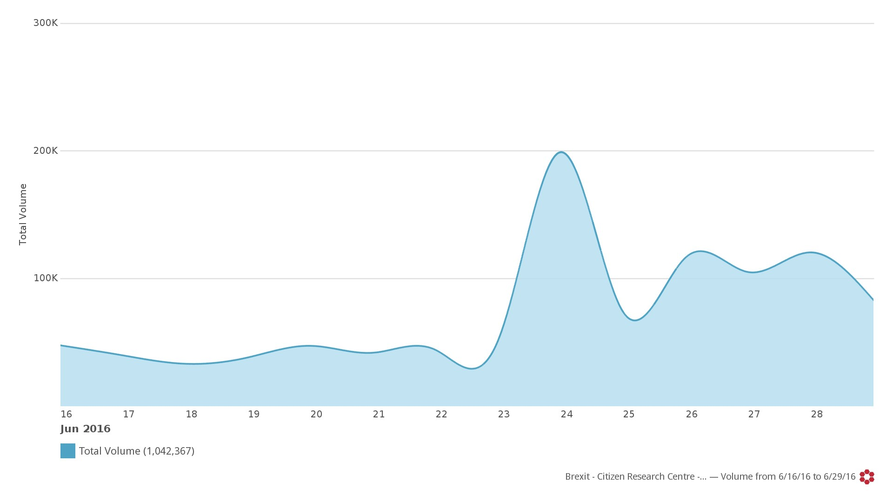

The @PostRefRacism Twitter handle has been mentioned over than 4,300 times since the referendum, more than any other.  #PostRefRacism has been used more than 34,000 times since the 23rd of June. The only on-topic hashtag that was used more is, unsurprisingly, #Brexit.

        

    

    

        

    

        

    

    

        

    

        

    

    

        

    

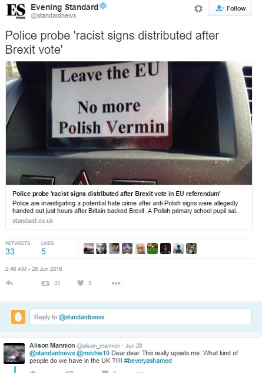

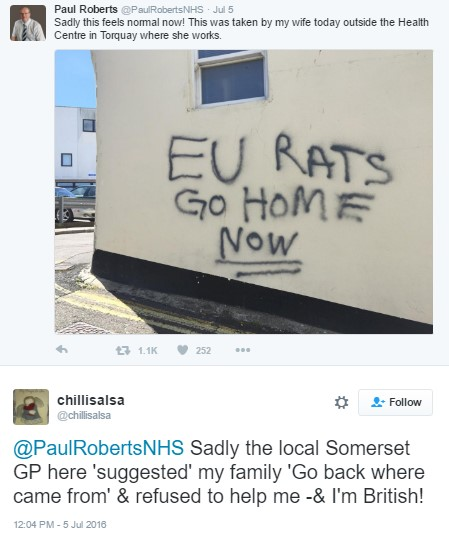

        

    

    

        

    

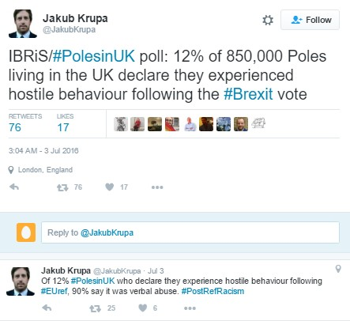

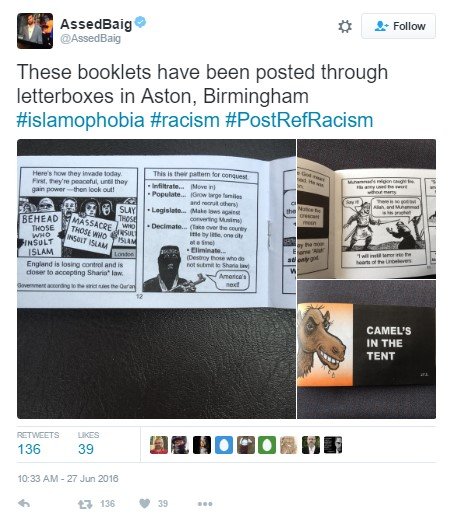

        

    

    

        

    

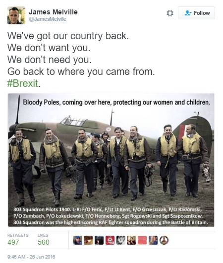

        

    

    

        

    

    <h3>Legitimising Hatred: The Backlash</h3>

While not all Leave campaigners campaigned on a racist platform, there is clear and startling evidence that the success of the Leave campaign has led to racists feeling justified in their bigotry.  This theme was picked up on before the Brexit vote, in which some Leave supporters felt obliged to defend their position, saying it wasn’t based on racism.

        

    

    

        

    

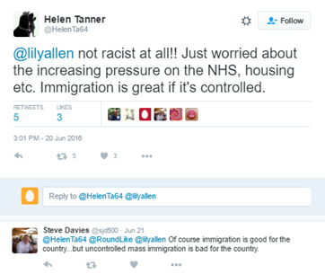

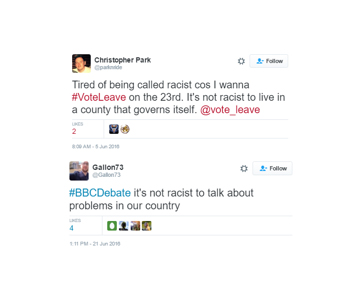
    

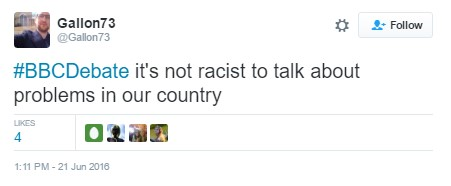

        

    

    

        

    

    
It was also extensively discussed after the vote:

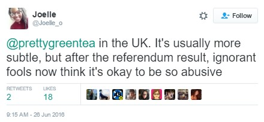

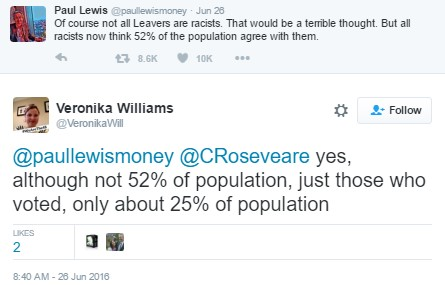

    

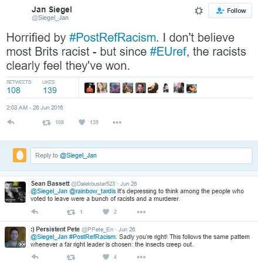

        

    

    

        

    

    
The backlash against this racism can be most clearly seen in a sentiment chart (below). On the 7th June over 20% of the conversation was defined as being positive (in favour of) racist speech on social media, by the 26th of June this had fallen to under 10% of conversation.

    
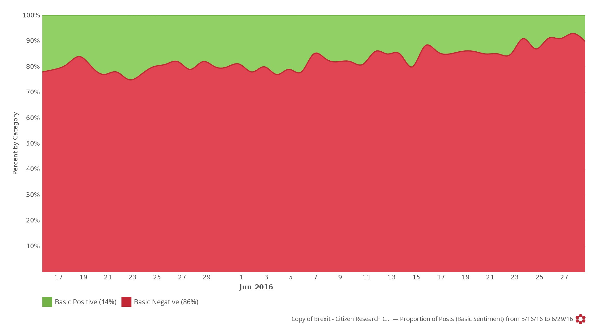

    
So if there is a silver lining to this, it is that social media began to correct itself, with a host of Facebook albums and Twitter accounts set up as forums to discuss and share stories of hate crimes and intimidation. The @PostRefRacism Twitter handle has been mentioned over than 4,300 times since the referendum, more than any other.  #PostRefRacism has been used more than 34,000 times since the 23rd of June. The only on-topic hashtag that was used more is, unsurprisingly, #Brexit.

        

    

    

        

    

    
And supporters of both camps started to speak out strongly against racism:

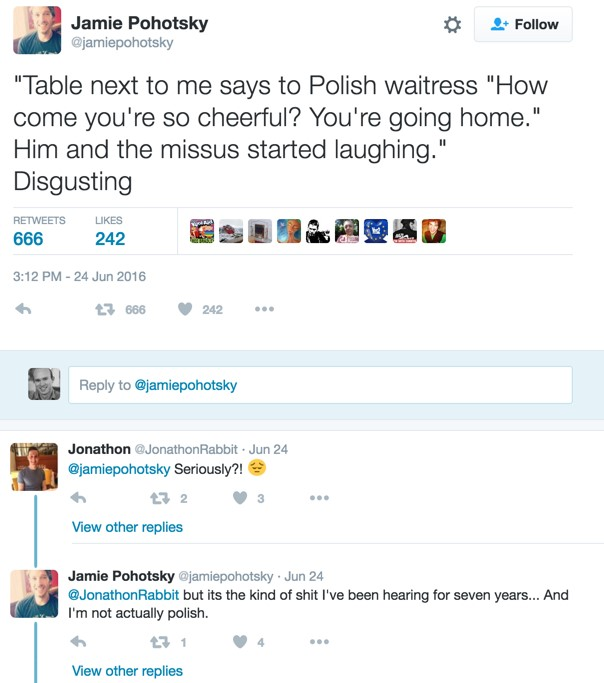

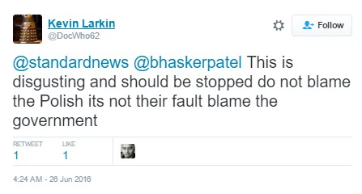

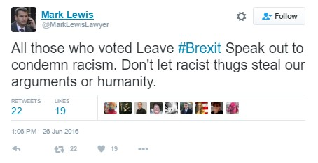

        

    

    

        

    

    
Social media has become, at least in part, a call-to-action platform in post referendum Britain. It has been used to promote ideals of solidarity and inclusiveness as well as sharing expressions on those ideals. Brits countrywide are being urged to report what they see and to stand up against bigoted behaviour. Civilians and police are sharing information and advice.

        

    

    

        

    

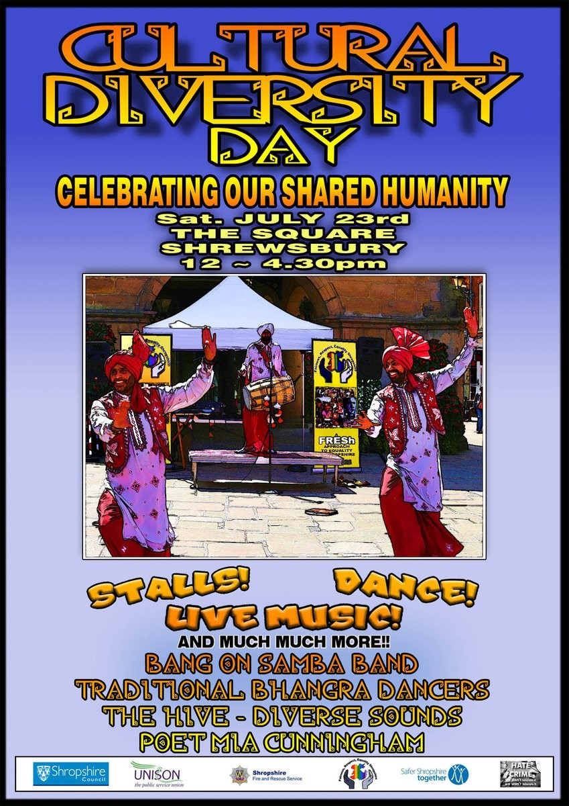

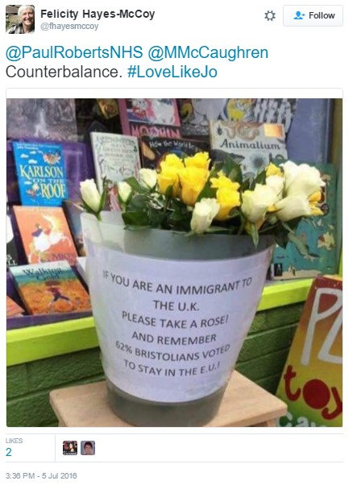

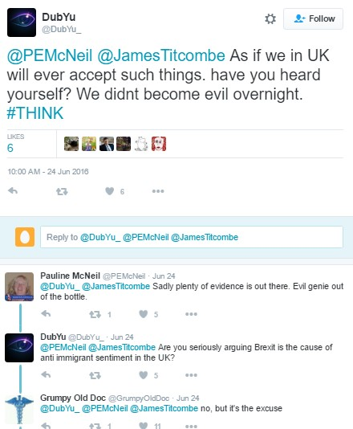

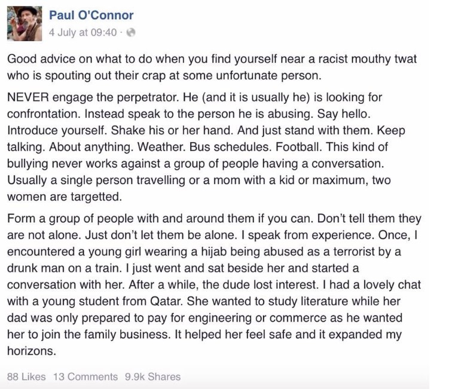

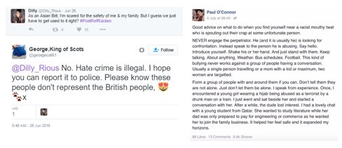

        

    

    

        

    

    <h3>Immigration: Genuine Concern or an excuse for racists?</h3>
    
A recent Oxford paper found that "EU migrants are less likely to claim out-of-work benefits, such as Jobseekers’ Allowance and incapacity benefit, compared to their UK counterparts," It goes on to state that "In February 2015, people who were EU nationals when they registered for a National Insurance Number made up 2.2% of the total [Department for Work and Pensions] working-age benefits caseload, but were about 6% of the working-age population."
British hostility to immigrants predates the recent spate of mass immigration. An Oxford University study by Scott Blinder, looking at historical polling data spanning decades found that Brits believed there were “too many immigrants” long before the net immigration could have any appreciable effect on the British economy.

Along with the perceived tax on the UK’s social services, immigrants taking British job was a hot topic during campaigning so you would expect hostility about immigration to be correlated to the actual level of immigration. But it’s not.

A paper by Torsten Bell, director of the UK economic think tank Resolution Foundation, found no correlation at all between the share of votes for Leave in the referendum and the areas where wages have fallen since 2002 - theoretically the areas hardest hit by the financial crisis, or those where migration is said to have held down wages.

Although pro-Brexit voters weren’t primarily from areas which had become poorer since the immigration wave, they did come from historically poor areas, dating back to the late 70’s. The status quo is enough to understand their anger and immigrants are tried and tested scapegoat.

And while racism certainly rose after Brexit, it has always been there. In our UK data for the first 5 months of 2016 we found an average of 23,949 posts per day referencing xenophobia, racism, and other hate crimes.  

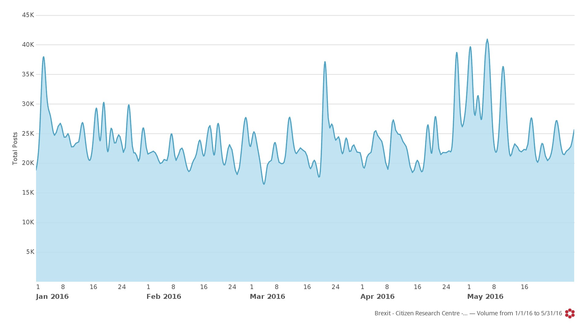

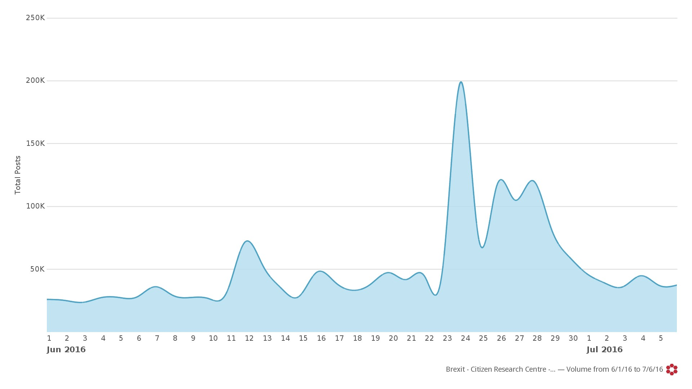

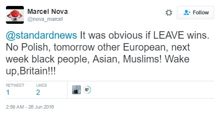

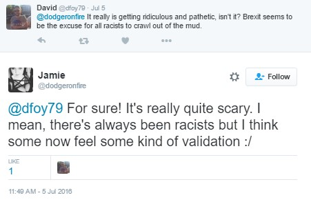

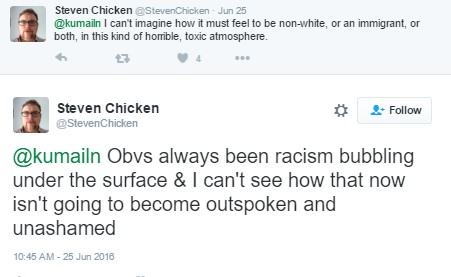

<h3>Does Rhetoric Matter?</h3>

Both in the USA and in the UK, we have seen a rise in hate crimes and racism off the back of ugly political campaigns that have focused on division. We looked at the top 10 twitter handles for 2016 in the UK, and we see that politicians dominate, with Donald Trump the top twitter handle. Even Donald Trump Jnr is in the top ten!  And Nigel Farage is fifth.  So what these politicians say is certainly having an impact on public discourse. 

        

    

    

        

    

And the media of course weighs in as well, spitting its fury at migrants…:

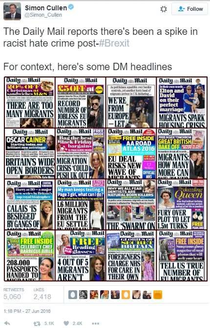

<h3>And after the vote, the fallout…</h3>

By legitimising extremist views, politicians hand a blank cheque to bigoted individuals, and significantly stoke the flames of racism and hatred. But when they are exposed society tends to fight back – and we can only hope that tolerance and empathy win over narrow bigotry. 

        

    

    

        

    

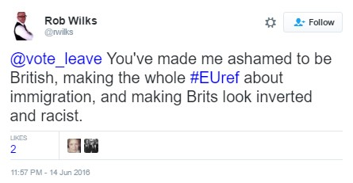

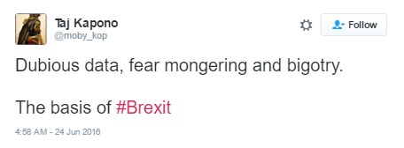

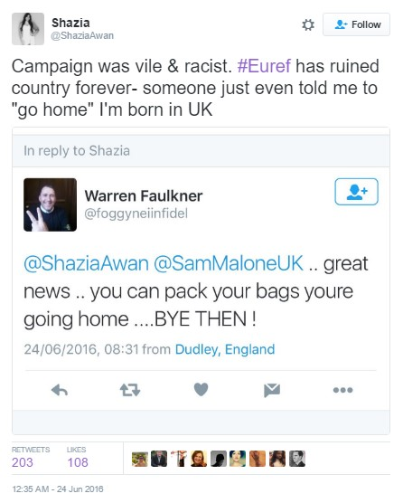

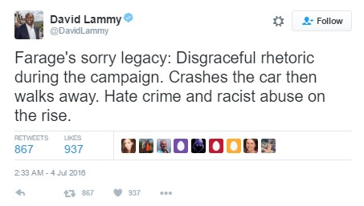

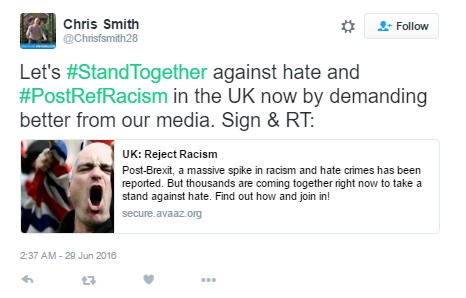

        

    

    

        

    

    <h3>In closing (strong language warning!)</h3>
    
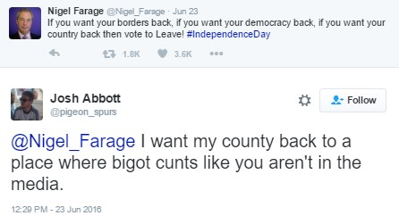

    
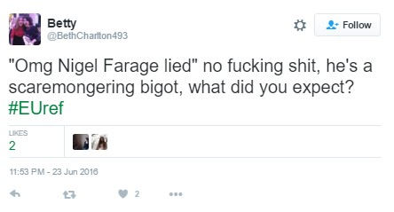

    
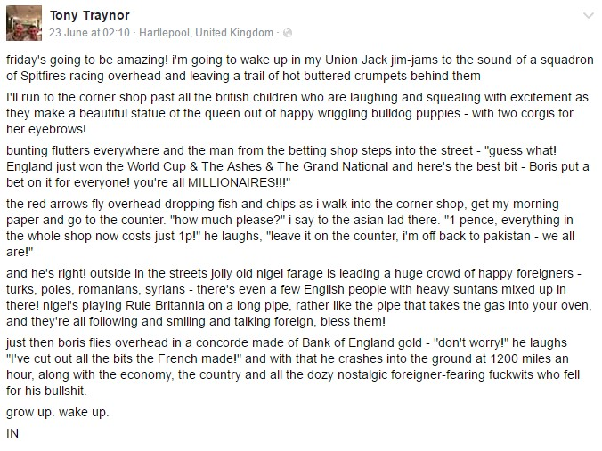

        

    

        

    

<h3>About The Citizen Research Centre</h3>

<a href="{{site.url}}" target="_blank">The Citizen Research Centre</a> is an organisation dedicated to investigating our societies and providing accurate, meaningful data that can be used to effect change – through knowledge, understanding of ourselves and ‘the other’ and through policy.

We describe what we do as social research. This is research done in order to improve and expand on our knowledge of the world by providing decision makers in social policy and intervention projects with the best data possible.

We run primary face-to-face research - both quantitative and qualitative - in 54 countries in Africa and the Middle East. <a href="where-we-work.html" target="_blank">Click here</a> for a list of countries in which we run face-to-face research.

We run analytic research on social media globally through our partnership with <a href="http://www.crimsonhexagon.com/" target="_blank">Crimson Hexagon</a>, arguably the best social media analysis platform in the world. This and other reports are generated through mining and reporting on our social media data base, which currently holds almost 1 trillion pieces of social media data!

We are committed to providing research on Citizens, and also research for Citizens – that reflect their own views back to them through social media analytics.
The nature of social media analysis is such that any topic can be rigorously explored.  If you would like to purchase in depth reporting on this or any other topic, please contact us
  <h3 style="text-align: center;"><a href="mailto:info@citizenresearchcentre.org">info@citizenresearchcentre.org</a></h3>

    

    

