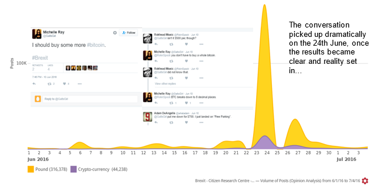
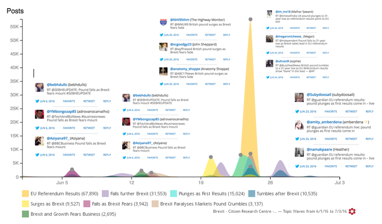

    

        

    

The Brexit referendum result had a dramatic effect on currencies around the world, and on the pound in particular. It also impacted on crypto currencies, the most famous of which is Bitcoin.

Using <a href="http://www.crimsonhexagon.com/" target="_blank">Crimson Hexagon</a>, we analysed social media traffic from the 1 June to the 4th July 2016 to find out more. 

Overall conversation on Brexit over this period comprised 8,030,014 pieces of social media data. Of these, 360 491 posts concerned the pound and various crypto currencies.

Of these 360 4912 posts, 88% focused on the pound and 12% on crypto currencies.

Most of the conversation took place around and after referendum day, with 46% of the conversation taking place on June the 24th:

<h3>Pound Centric Conversation Topic Waves</h3>

Pound centric conversation was all doom and gloom once the result was announced: 

<h3>Crypto Currency Centric Conversation Topic Waves</h3>

Crypto Currency conversation by contrast was quite upbeat – with crypto currencies touted as an increasingly attractive option following the Brexit referendum.  Most of the conversation concerned the spike in the Bitcoin prices, with minor themes being the growth of Bitcoin in popularity after the referendum.

While this has since corrected, immediately following the vote, the Pound dropped as much as 9%, and the value of Bitcoin climbed by 8%.

<h3>Topics of Conversation</h3>

This trend continued in the topic wheels of the conversations. The Pound conversation was largely doom and gloom…

While the Crypto Currency conversation was more hopeful:

<h3>Affinities</h3>

A powerful tool in Crimson Hexagon’s social media analysis box is affinities analysis. Here we were able to match the interests of the people contributing to the Pound conversation against the rest of twitter, so the same for the members of the Crypto Currency conversation and then look at the variances of each against each other.

Those contributing to the Pound conversation tended to be more ‘establishment’ – interested in stock markets, forex, David Cameron and finance.

Those contributing to the Crypto Currency conversation were demonstrably more forward thinking – and tended to be interested in Noam Chomsky, P2P (sharing services), Bitcoin and Reddit. 

<h3>Implications</h3>

As established currencies wax and wane, hedges emerge… Traditionally gold has been the hedge in turbulent times –now crypto currencies also play a role.

While this piece has focused on the pound, emerging market currencies and economies usually bear the brunt of political uncertainty and social upheaval. Strong, coherent policies that are supported by citizens are the hallmark of a stable democracy. Brexit has shown us that even the most developed economies hide fractured societies, with disparate ambitions and goals for their future. Fear hides in the wings, and politicians need to beware of reducing complex decisions to binary options in referenda.

    

    

        

    

<h3>About The Citizen Research Centre</h3>

<a href="{{site.url}}" target="_blank">The Citizen Research Centre</a> is an organisation dedicated to investigating our societies and providing accurate, meaningful data that can be used to effect change – through knowledge, understanding of ourselves and ‘the other’ and through policy.

We describe what we do as social research. This is research done in order to improve and expand on our knowledge of the world by providing decision makers in social policy and intervention projects with the best data possible.

We run primary face-to-face research - both quantitative and qualitative - in 54 countries in Africa and the Middle East. <a href="where-we-work.html" target="_blank">Click here</a> for a list of countries in which we run face-to-face research.

We run analytic research on social media globally through our partnership with <a href="http://www.crimsonhexagon.com/" target="_blank">Crimson Hexagon</a>, arguably the best social media analysis platform in the world. This and other reports are generated through mining and reporting on our social media data base, which currently holds almost 1 trillion pieces of social media data.

We are committed to providing research on Citizens, and also research for Citizens – that reflect their own views back to them through social media analytics.
The nature of social media analysis is such that any topic can be rigorously explored.  If you would like to purchase in depth reporting on this or any other topic, please contact us
  <h3 style="text-align: center;"><a href="mailto:info@citizenresearchcentre.org">info@citizenresearchcentre.org</a></h3>

    

    

  

   
