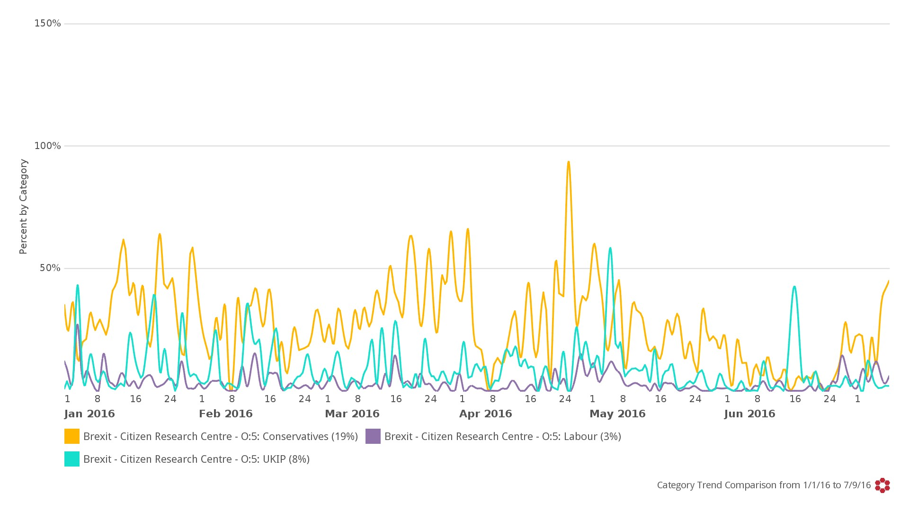

    

        

    

<h3>Overview: 1 January to 9 July 2016</h3>

These days it seems politicians are practically expected to lie – and no more so than in the debates pre and post the Brexit vote.

Who do people think told the biggest whoppers? This research looked at social media activity in the UK from the 1st January to the 9th July 2016 to find out…

We used Crimson Hexagon (link), a leading social media analytics platform, to identify 694,154 pieces of social media data referring to politicians and their lies between 1 January and 9 July 2016.

The conversation peaks in April, when the Panama Papers were released, and shows enormous growth around the time of the Brexit referendum. It peaks on the day of the vote with 37,170 number of posts.

Note the timeline volume below, with the peak on the 24th largely related to the 350 million pound NHS porker perpetrated by the Leave campaign in general, and by Nigel Farage in particular…

<h3>The Political Parties: 1 January to 9 July 2016</h3>

If we look at the data, by political party, across the research period, we find the following.

The conservatives handed us a textbook case of what happens when your part is not only divided over an issue but opposing camps campaign fiercely for their respective positions. They garnered 19% of the total conversation over the period. UKIP of course is divisive by its nature, but unified by its goal – they received 8% of conversation.

And Labour seems fairly well trusted across the board with only 3% of conversation dedicated to its fabrications.

<h3>The people behind the numbers: 1 January to 9 July 2016</h3>

So who told the most lies, according to opinion expressed on social media in the UK?

We carefully trained a monitor on Crimson Hexagon to find out.

Over the total research period (1 January to 9 July 2016), here’s roll call of mistrust. Perhaps it’s just a Prime Ministers lot, but David Cameron was the least trusted politician with 21% of the conversation dedicated to him. The Conservatives (19%) as a whole were far less trusted than Labour (only 3%), with key Leave campaigners Nigel Farage (13%) and Boris Johnson (10%) right up there in the lack of trust stakes. :

<h3>The people behind the numbers: 1-22 June vs 23 June-9 July 2016.</h3>

Of course the lying peaked right around the Brexit campaign! So who was most reviled on social media before and after the vote?

Interestingly, David Cameron dropped from 21% of the conversation to just 4% after the vote, perhaps due to his honourable resignation.

Boris Johnson took a while to step down from his ambitions, and shot up from 8% to 24% after the Brexit vote! This massive rise in bad sentiment was fueled by purported lies he told, and also by his decision to step down from his campaign to lead the Tories. 

Nigel Farage remained pretty steady at 22% before and after – presumably social media didn’t have very high expectations of him.

Michael Gove tripled his score from 3% to 9% in the wake of the Brexit vote.

The Conservatives rise from 6 to 10 percent, as the fallout hits the party.  And Labour also rises from less than 1% to 4% as they are also plunged into crisis.

    

    

        

    

<h3>About The Citizen Research Centre</h3>

<a href="{{site.url}}" target="_blank">The Citizen Research Centre</a> is an organisation dedicated to investigating our societies and providing accurate, meaningful data that can be used to effect change – through knowledge, understanding of ourselves and ‘the other’ and through policy.

We describe what we do as social research. This is research done in order to improve and expand on our knowledge of the world by providing decision makers in social policy and intervention projects with the best data possible.

We run primary face-to-face research - both quantitative and qualitative - in 54 countries in Africa and the Middle East. <a href="where-we-work.html" target="_blank">Click here</a> for a list of countries in which we run face-to-face research.

We run analytic research on social media globally through our partnership with <a href="http://www.crimsonhexagon.com/" target="_blank">Crimson Hexagon</a>, arguably the best social media analysis platform in the world. This and other reports are generated through mining and reporting on our social media data base, which currently holds almost 1 trillion pieces of social media data.

We are committed to providing research on Citizens, and also research for Citizens – that reflect their own views back to them through social media analytics.
The nature of social media analysis is such that any topic can be rigorously explored.  If you would like to purchase in depth reporting on this or any other topic, please contact us
  <h3 style="text-align: center;"><a href="mailto:info@citizenresearchcentre.org">info@citizenresearchcentre.org</a></h3>

    

    

